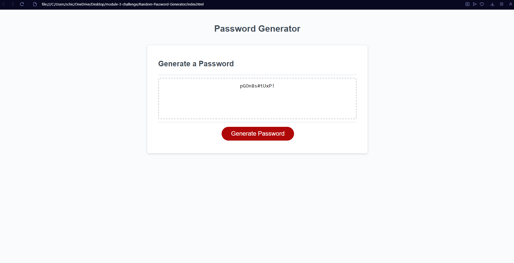

# Password Generator

## Description

This Module 3 Challenge was given to me to complete. The goal was to build a randomized password generator. 

## Installation

N/A

## Usage

To use this webpage, you can click on "Generate Password". By doing so, this will create a series of prompts for you to select the criteria in which you would like in your new generated password. The password will be at least 8 characters but no more than 128 characters. Your new password, given your selected criteria, will display in the box on the webpage.

## Credits

I worked on this project with my study group peers, Chase Seeberger and Shelby Hutchinson.

## Link

https://willber10.github.io/Random-Password-Generator/

## Screenshot

## License

Please refer to the LICENSE in the repository.